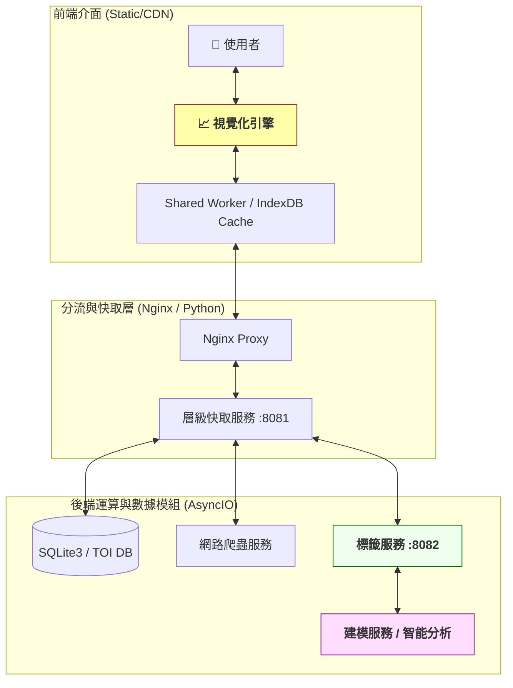
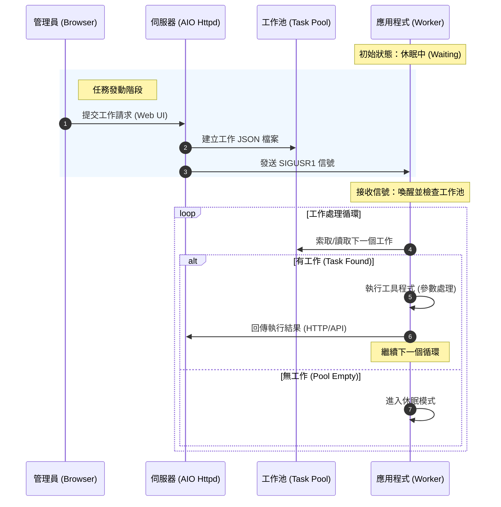
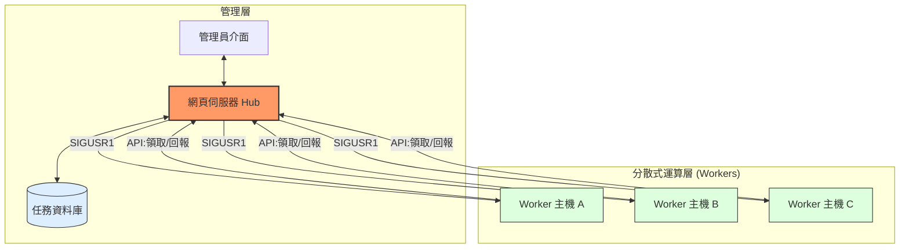
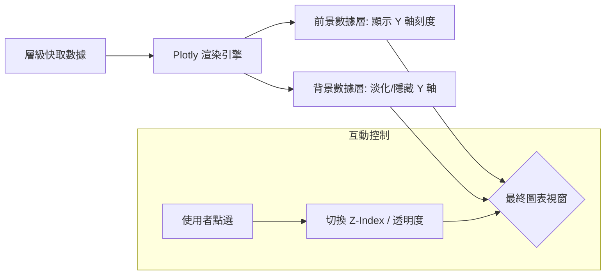
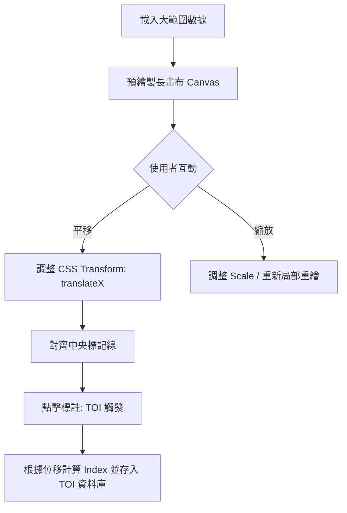
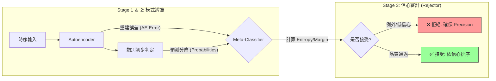

# AlphaCache 財金數據分析平台技術規格書

## 一、 系統架構概要

本系統採用多伺服器架構，核心設計原則為**前端高可用性 (High Availability)** 與**後端非同步 (Asynchronous) 運算**。為符合資訊系統 CIA 三原則，架構設計重點在於確保使用者端的最高可用性，同時透過多重快取機制平衡數據的完整性。

### 1.1 系統架構圖

<div style='text-align:center;border:1px solid silver;'>[圖1.1] 系統架構圖


</div>

### 1.2 服務實體類型定義
本系統將服務劃分為三種主要實體類型：

1.  **純客戶端運行 (Client-side Interactive)**：
    * **對應模組**：視覺化引擎服務。
    * **技術特性**：採用 JavaScript, CSS 與 DOM 技術在使用者裝置端即時生成視覺效果。
    * **關鍵效益**：運算壓力去中心化，可透過 CDN 達到全時服務不中斷 (24/7)。
2.  **伺服器端網頁服務 (Server-side Hub)**：
    * **對應模組**：層級快取服務、標籤服務。
    * **技術特性**：管理者介面與應用程式間的資料交換樞紐，處理同步請求並管理任務調度。
3.  **純應用程式工具 (Background Workers)**：
    * **對應模組**：網路爬蟲服務、建模服務。
    * **技術特性**：透過 SIGUSR1 信號驅動工作池 (Task Pool)，負責高負載的採集與訓練任務。

為兼顧可用性與 DevOps 的需求，伺服器端的工作皆採用 **伺服器網頁服務** 搭配 **純應用程式工具** 的方式進行。
如圖 1.2 所示，本系統採用非同步的信號驅動機制。
管理員透過網頁伺服器提交任務後，伺服器將任務實體化至工作池，並發送系統層級的 SIGUSR1 信號喚醒處於休眠狀態的應用程式。
應用程式被喚醒後即進入處理循環，透過 Web API 索取任務細節並回報執行結果，直到工作池清空後再次進入休眠，以達成極低能耗且反應即時的任務處理。

<div style='text-align:center;border:1px solid silver;'>[圖1.2] 工作時序說明


</div>

這個設計的好處是，當系統的支援漸趨完整，負載增加之時，服務將具有可延展性。
如圖 1.3 所示，藉由 Web API 實現的解耦合設計，網頁伺服器可演進為集中式的調度樞紐（Hub），管理分布於不同物理主機上的多個應用程式執行單元（Workers）。伺服器能透過統一的信號分發與 API 狀態監控，確保多個任務在不同的 Worker 主機間維持原子性操作與負載平衡，實現高效能的分散式運算架構。

<div style='text-align:center;border:1px solid silver;'>[圖1.3] 多應用主機架構


</div>
---

## 二、 核心服務模組規格

### 2.1 視覺化服務 (靜態網站技術)
* **數據獲取**：優先請求 CDN 靜態 JSON 資料，失敗時轉向數據快取服務請求。
* **功能要點**：
    * 純客戶端運行 (Client-side Interactive)
    * 供使用者互動檢視與標定 Time of Interest (TOI)。
    * 支援人工標籤與機器學習預測標籤的對比檢視。
    * 多對象，多指標，多區段，前景背景集合疊合檢視 [圖 2.1]
    * 為簡化操作流程，本系統採用「中央對齊標定法」。使用者僅需平移走勢圖使目標事件對齊視窗中央線，系統即透過下式自動換算數據索引：
$I_{toi} = \left\lfloor \frac{X_{offset} + \frac{W_{view}}{2}}{P_{dist}} \right\rfloor$
其中 $I_{toi}$：數據索引 (Index)，$X_{offset}$：畫布向左偏移像素值之絕對值，$W_{view}$：可見視窗寬度，$P_{dist}$：單位數據點像素寬度。
    * 單調操作，使用者僅需利用縮放與平移兩個功能就可將數據移動到關注區域內，並進行標籤的設定 [圖 2.2]。
    * 點擊檢視單一時間點數據資訊，釘選表格必較多組數據資訊。

<div style='text-align:center;border:1px solid silver;'>[圖 2.1] 走勢圖工具，異質多層次疊合方法。


</div>
<br/>
<div style='text-align:center;border:1px solid silver;'>[圖 2.2] 走勢圖工具，單純操作控制方法。


</div>

### 2.2 層級快取服務 (Leveling Cache)

* **多層快取機制：**
  * **L1 (Client Side)**：利用瀏覽器 IndexDB 存儲已下載的年度資料段（Data Segments），減少重複的網路請求。
  * **L2 (Server RAM)**：網頁伺服器（AIO Httpd）於記憶體維護近期熱門查詢的資料快取表，提供微秒級的反應速度。
  * **L3 (Persistent Storage)**：伺服器端本地 SQLite3 資料庫，作為指標數據與原始數據的永久存儲層。

* **例外處理與任務調度：** 資料缺失時伺服器回覆 $Syncing$ 標籤告知使用者，並同步觸發後端爬蟲或計算任務。為了確保系統效率，本服務具備 **「原子性請求合併 (Atomic Request Joining)」** 功能：若多個使用者同時請求同一個缺失的年度資料，系統僅會派發一個 $TaskID$，避免重複執行爬蟲任務對外部數據源造成壓力。

* **指標計算服務 (Indicator Service)：** 負責計算資料的相關指標數據並快取之。系統採取「預計算 (Pre-calculation)」策略，當原始資料更新時即觸發指標運算並存入 L3，確保前端請求時能直接獲取完整指標，無需重新運算。

* **數據有效性管理 (Data TTL)：**
  * **歷史資料：** 非當前年份之資料視為靜態唯讀，可永久快取於各層。
  * **當前資料：** 當前年度資料設定「生存時間 (Time-To-Live)」，定期過期並觸發自動同步以維持資料即時性。

* **數據封裝格式：**
  * **請求單位：** 以年為基本單位。例如：$?2330_TW-2025$ 將傳回台積電 2025 年的資訊。
  * **回覆規範：** 回覆格式為包裹字典的串列（List of Dictionaries）。舉例來說：[0, {"O":100, "C":105, "H":110, "L":95, ...}] 表示該年度第二天的資料為 100/105/110/95。沒有交易資料之日期將以 0 代替，以優化資料傳輸效能與解析成本。

**任務描述實體與重試策略 (Task Schema)**
本服務採用網頁伺服器搭配應用程式的框架實現。伺服器使用 SIGUSR1 訊號通知應用程式領取任務 JSON 描述。為應對網路不穩定等例外，JSON 結構中納入了錯誤重試機制：
```json
{
  "TaskID": 1234,
  "Script": "yfinance",      // 指定執行工具 (Python/PlayWright/Shell)
  "Args": {                  // 工具參數設定
    "Target": "2330.TW",
    "Since": "2025-01-01",
    "Range": 365
  },
  "Retry": 3,                // 最大重試次數
  "Callback": {              // 完成後回報之 API 路徑
    "URI": "/api/commit?taskID=1234",
    "Body": "{...}"          // 回報之數據內容封裝範本
  }
}
```

### 2.3 標籤服務 (Labeling Service)
服務定位：本服務運行於本地主機（或雲端樞紐）的 8082 通訊埠，作為前端 「視覺化引擎」 與後端 「建模服務」 之間的數據中繼站。其核心功能是將使用者產生的標註匯聚成結構化的學習資料。

* **TOI 標籤管理：**
  * **人工標註 (Manual TOI)：** 接收來自前端透過「中央對齊標定法」產出的索引數據，並記錄標註者資訊與標籤類別。
  * **機器預測 (AI Predicted)：** 同步顯示由建模服務產出的模式辨識結果，供使用者進行比對與驗證。
  * **衝突處理：** 當人工標註與機器預測重疊時，系統提供權重設定，優先採信人工標定之數據作為後續訓練的 Ground Truth。

* **管理與調度功能：**
  * **模型訓練發動：** 管理者可透過標籤服務的管理頁面，定義訓練集範圍（如：特定年份、特定標的）並發送任務指令予建模服務。
  * **即時辨識開關：** 提供開關控制是否在視覺化前端顯示即時的模式辨識標籤。

* **多主機與權限擴展：**
  * **貢獻者認證：** 具備資料貢獻者認證管理，確保 TOI 資料的來源可靠性與權限控管。
  * **分散式支援：** 支援多台應用主機（Workers）同時回報標籤結果，並由本服務進行統一的匯整與去重處理。

**標籤數據交換格式 (Label Schema)**
前端送出或後端回報標籤時，採用以下 JSON 結構：

```json
{
  "Target": "2330.TW",
  "Type": "TOI",             // 標籤類型：TOI, Pattern, Event
  "Source": "Manual",        // 來源：Manual (人工) 或 AI_Model_V1 (機器)
  "Data": [
    {
      "Index": 125,          // 根據中央對齊法計算出的數據索引
      "Label": "Stage_3",    // 標註類別 (如：起漲點、盤整期)
      "Confidence": 1.0,      // 人工標註為 1.0，機器標註則帶入模型信心分數
      "Timestamp": "2026-01-01T12:00:00Z"
    }
  ]
}
```

**標籤服務與建模服務的協作邏輯**

* **資料收集：** 視覺化服務將使用者標定的 TOI 傳送至標籤服務。
* **訓練請求：** 管理者於標籤服務介面確認資料足夠後，發動訓練任務。
* **異步建模：** 標籤服務將任務寫入資料庫，並發送 SIGUSR1 訊號通知建模服務領取任務。
* **結果更新：** 建模服務完成後透過 API 回傳新標籤，標籤服務更新資料庫並通知前端重新整理檢視。

---
### 三、 智能分析模型：三階段決策框架

本系統不限制特定學習引擎，現階段採用 Autoencoder、Dense Classifier 與 Decision Tree 的混合架構。其核心設計理念在於利用無監督學習捕捉市場的常態模式，並透過 Meta-Classifier 學習模型自身的偏誤，以在極端行情下維持系統的魯棒性（Robustness）與極高精準度（High Precision）。

#### 3.1 階段一：無監督特徵學習 (Unsupervised Feature Learning)

**目標**：透過 Seq2Seq Autoencoder 學習財金數據的「潛在表示」，將高維度的時序特徵壓縮為具備語義信息的特徵向量。

* **數據準備**：
    * **輸入 $X$**：採用 252 天（約一交易年）的滑動窗口，包含 $N$ 個參數（如 OHLC、成交量及技術指標）。
    * **預處理**：進行時間序列歸一化（Normalization），確保不同量級的指標（如股價與成交量）在同一尺度下運算。
* **網絡架構**：
    * **Encoder (編碼器)**：利用 LSTM 層處理時序連續性，將序列 $X_{252 \times N}$ 壓縮至潛在空間向量 $z$ (Hidden State)。
    * **Decoder (解碼器)**：將 $z$ 作為輸入，透過 RepeatVector 重構出與原始輸入相同維度的序列 $X'$。
* **損失函數**：
    * 採用均方誤差（Mean Squared Error, MSE）：$$L_{ae} = \|X - X'\|^2$$
    * **重建誤差 (Reconstruction Error) 的價值**：訓練完成後，該誤差可作為衡量「數據異質性」的指標。當誤差異常大時，代表當前行情脫離了歷史常態，即 Out-of-Distribution (OOD) 狀態。

#### 3.2 階段二：有監督分類 (Supervised Stage Classification)

**目標**：利用階段一提取的高效特徵向量 $z$，進行特定市場階段（如起漲點、盤整期）的分類辨識。

* **模型結構**：
    * **輸入層**：接收來自編碼器的潛在向量 $z$。
    * **隱藏層**：採用多層全連接神經網路（Dense Layers），並使用 ReLU 激活函數以捕捉非線性關係。
    * **輸出層**：採用 Softmax 激活函數，將結果轉換為各類別的機率分佈 $P = [p_1, p_2, ..., p_k]$。
* **訓練邏輯**：
    * 標籤來源於「2.3 標籤服務」中收集的人工標註 TOI。
    * 損失函數採用類別交叉熵（Categorical Crossentropy），優化模型對特定模式的辨識能力。

#### 3.3 階段三：Meta-Classifier 品質監控 (Confidence Scoring)

**目標**：作為系統的「防禦門檻」，透過審計前兩階段的輸出，攔截潛在的誤判，確保輸出的極高精準度 (Precision)。

* **特徵工程 (Meta-Features)**：從第一、二階段提取反映「不確定性」的數據作為輸入：
    1. **最大機率值 (Max Probability)**：預測類別的絕對信心分。
    2. **預測熵值 (Entropy)**：衡量類別分佈的混亂度。公式為 $$H(P) = -\sum p_i \log(p_i)$$
    3. **邊際差距 (Margin)**：第一名與第二名機率的差值，反映分類邊界的模糊度。
    4. **重建誤差 (AE Error)**：來自階段一，反映資料是否為極端例外狀況。
* **決策邏輯 (Decision Tree)**：
    * 採用決策樹 (Decision Tree) 訓練「接受/拒絕」的規則。
    * **優勢**：提供極佳的可解釋性 (Explainability)。例如管理者可查閱規則：「若 AE Error > 0.5 且 Entropy > 0.8，則攔截訊號」。
* **輸出機制**：
    * **Reject (攔截)**：對於低信心或異常資料，系統不予輸出，以確保極高精準度。
    * **Rank (排序)**：對於通過審計的訊號，根據 Meta-Classifier 的信心分進行排序，產出投資優先順序名單。

#### 3.4 系統決策矩陣
<div style='text-align:center;border:1px solid silver;'>[圖 3.1] 數據從輸入到最終決策的過濾流向：


</div>